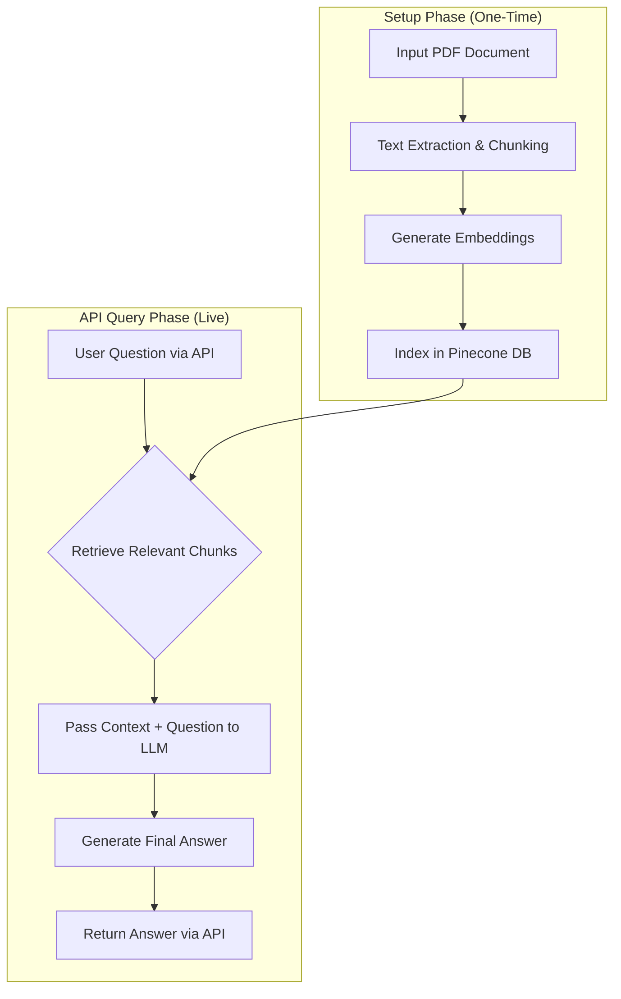

# 🧠Spe Knowledge Assistant
## 📄 Document Q&A API with RAG and Pinecone

**A high-performance, API-first implementation of a Retrieval-Augmented Generation (RAG) system for querying PDF documents.**

---
##  Video Demo 🎥

**Watch a video walkthrough of the API in action:**

[**[Link to Your Video Demo Here]**](https://youtu.be/Tkky0KUepw8?si=CjOLjMBp8PH8_TLa)

---

##  Overview 📝

This project implements a robust Retrieval-Augmented Generation (RAG) pipeline designed to answer natural language questions about the contents of a PDF document. Unlike a front-end application, this project focuses on creating a scalable and efficient backend service.

The system is built as a **FastAPI application**, exposing a simple API endpoint that accepts a user's question and returns a precise, context-aware answer. It leverages the power of **Pinecone's** serverless vector database for incredibly fast semantic search and **Hugging Face** models for state-of-the-art language understanding.

---

##  Key Features ✨

* **📄 PDF Document Processing:** Ingests any PDF document using `PyMuPDF`, automatically extracting and chunking the text for analysis.
* **☁️ Cloud-Native Vector Database:** Uses **Pinecone** for a scalable, serverless, and high-performance vector store, enabling rapid retrieval of relevant information.
* **🚀 API-First Design:** Built with **FastAPI**, creating a clean, fast, and easily deployable web service for the Q&A functionality.
* **⚡ Advanced RAG Pipeline:** Orchestrated with **LangChain**, this system combines the retrieved context from Pinecone with a powerful Language Model to generate accurate and relevant answers.
* **🌐 Publicly Accessible:** The notebook includes instructions for exposing the local FastAPI server to the public internet using `ngrok`, making the API instantly testable and shareable.

---

##  System Architecture 🏗️

The application follows a streamlined, API-centric workflow, optimized for performance and scalability.



1.  **Indexing:** The PDF is processed, its text is chunked, and each chunk is converted into a vector embedding. These embeddings are stored and indexed in a Pinecone database. This is a one-time setup process for each new document.
2.  **Querying:** A user sends a question to the FastAPI endpoint.
3.  **Retrieval:** The system generates an embedding for the question and uses it to perform a similarity search in Pinecone, instantly retrieving the most relevant text chunks from the original document.
4.  **Generation:** The retrieved chunks (the context) and the original question are passed to a Large Language Model, which synthesizes the information to generate a final, coherent answer.
5.  **Response:** The generated answer is sent back as a JSON response from the API.

---

##  Technology Stack 🛠️

| Technology        | Description                                                              |
| :---------------- | :----------------------------------------------------------------------- |
| **Python** | The core programming language for the entire application.                |
| **FastAPI** | A modern, high-performance web framework for building the API.           |
| **Pinecone** | A cloud-native, serverless vector database for fast semantic search.     |
| **LangChain** | The primary framework for orchestrating the RAG pipeline and agents.     |
| **Hugging Face** | For accessing the open-source LLM and embedding models.                  |
| **PyTorch** | The deep learning framework powering the underlying language models.       |
| **PyMuPDF** | A lightweight and fast library for PDF text extraction.                  |
| **Ngrok** | A tool to create a secure tunnel to expose the local API to the internet.|

---

##  Local Setup & Installation ⚙️

To run this project, you will need API keys for both Pinecone and Hugging Face.

1.  **Clone the repository:**
    ```bash
    git clone [https://github.com/your-username/pdf-rag-api.git](https://github.com/your-username/pdf-rag-api.git)
    cd pdf-rag-api
    ```

2.  **Set up a Python environment:**
    ```bash
    python -m venv venv
    source venv/bin/activate  # On Windows, use `venv\Scripts\activate`
    ```

3.  **Install dependencies:**
    Open the notebook (`llm_project_RAG.ipynb`) and run the first cell to install all required libraries.

4.  **Set up API Keys:**
    This project requires API keys to connect to external services.
    * **Pinecone API Key:** Get your free key from the [Pinecone website](https://www.pinecone.io/).
    * **Hugging Face Token:** Get your free token from your [Hugging Face account settings](https://huggingface.co/settings/tokens).

    Store these keys securely. If running in a notebook environment like Kaggle or Colab, use their respective "Secrets" or "Secrets Manager" features.

---

##  Usage ▶️

1.  **Run the Notebook:** Open `llm_project_RAG.ipynb` and execute the cells in order.
2.  **Upload a PDF:** Follow the instructions in the notebook to specify the PDF file you want to process.
3.  **Start the API:** The notebook will launch the FastAPI server and use `ngrok` to generate a public URL.
4.  **Query the API:** You can now send `POST` requests to the public `ngrok` URL to ask questions about your document. You can use tools like `curl`, Postman, or a simple Python script to interact with your new API.

    **Example `curl` command:**
    ```bash
    curl -X POST "YOUR_NGROK_URL_HERE/ask" \
         -H "Content-Type: application/json" \
         -d '{"question": "What was the total revenue in the last fiscal year?"}'
    ```

---

##  License 📄

This project is licensed under the MIT License. See the [LICENSE](LICENSE) file for details.
